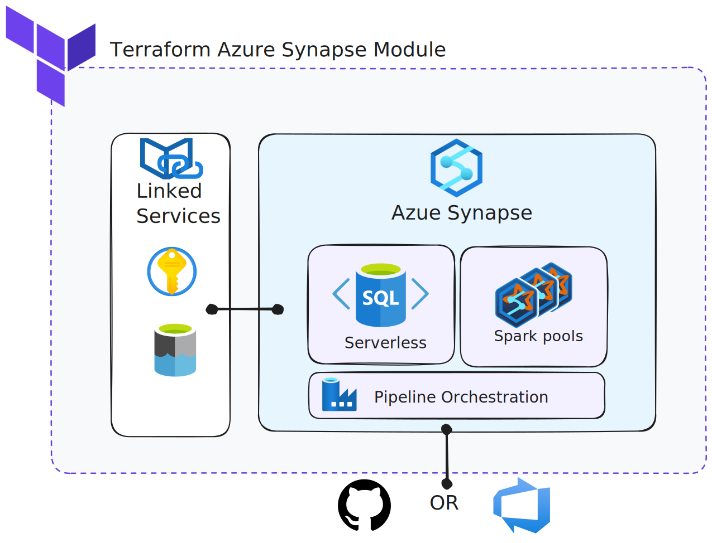

<!-- BEGIN_TF_DOCS -->
# Azure Synapse Analytics Terraform module

Terraform module which creates Synapse Analytics resources on Azure.

  

  ### Terraform module usage example

  Below you can find a simple example of how to reuse the module. 


  #### Example with public synapse workspace

  ```hcl
  


module "synapse" {
  source              = "../.."
  resource_group_name = "tf-arc-syn-demo"
  location            = "eastus"
  workspace_name      = "syn-arc-demo"
  stage               = "dev"
  storage_settings = {
    name                     = "stsynarcdemo001"
    account_tier             = "Standard"
    account_replication_type = "LRS"

  }
  key_vault_settings = {
    name                     = "kvsynarcdemo"
    sku_name                 = "standard"
    soft_delete_enabled      = false
    purge_protection_enabled = false
  }

  spark_pool_settings = [{
    name             = "pool1"
    spark_version    = "2.4"
    node_size        = "Small"
    node_count       = 3
    node_size_family = "MemoryOptimized"
    },
    {
      name             = "pool2"
      spark_version    = "2.4"
      node_size        = "Small"
      node_count       = 3
      node_size_family = "MemoryOptimized"
  }]
}
  ```


# Azure Synapse Module inputs

## Inputs

| Name | Description | Type | Default | Required |
|------|-------------|------|---------|:--------:|
| <a name="input_key_vault_settings"></a> [key\_vault\_settings](#input\_key\_vault\_settings) | n/a | <pre>object({<br>    name                     = string<br>    sku_name                 = string<br>    soft_delete_enabled      = bool<br>    purge_protection_enabled = bool<br>  })</pre> | n/a | yes |
| <a name="input_location"></a> [location](#input\_location) | n/a | `string` | `"westeurope"` | no |
| <a name="input_resource_group_name"></a> [resource\_group\_name](#input\_resource\_group\_name) | n/a | `string` | n/a | yes |
| <a name="input_spark_pool_settings"></a> [spark\_pool\_settings](#input\_spark\_pool\_settings) | n/a | <pre>list(object({<br>    name             = string<br>    spark_version    = string<br>    node_size        = string<br>    node_count       = number<br>    node_size_family = string<br>  }))</pre> | n/a | yes |
| <a name="input_stage"></a> [stage](#input\_stage) | n/a | `string` | n/a | yes |
| <a name="input_storage_settings"></a> [storage\_settings](#input\_storage\_settings) | n/a | <pre>object({<br>    name                     = string<br>    account_tier             = string<br>    account_replication_type = string<br>  })</pre> | n/a | yes |
| <a name="input_workspace_name"></a> [workspace\_name](#input\_workspace\_name) | n/a | `string` | n/a | yes |

# Azure Synapse Module outputs

## Outputs

No outputs.

# Azure Synapse Module providers

## Providers

| Name | Version |
|------|---------|
| <a name="provider_azurerm"></a> [azurerm](#provider\_azurerm) | >= 2.0 |
| <a name="provider_random"></a> [random](#provider\_random) | n/a |
<!-- END_TF_DOCS -->